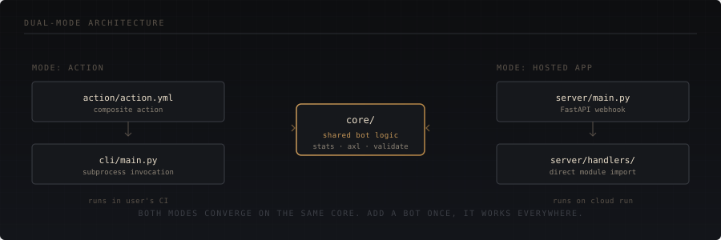
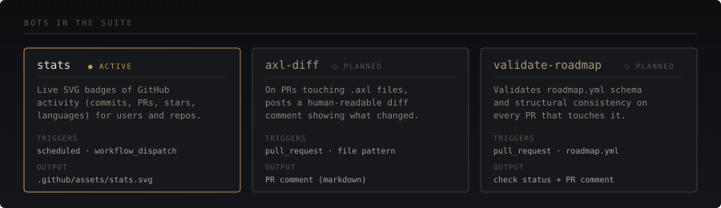

<p align="center">
  
</p>

<p align="center">
  <a href="https://github.com/Axylith"><b>Axylith</b></a>
  &nbsp;·&nbsp;
  <a href="https://github.com/Axylith/axle"><b>axle (editor)</b></a>
  &nbsp;·&nbsp;
  <a href="https://bots.axylith.com"><b>hosted app</b></a>
</p>

<p align="center">
  <a href="https://github.com/Axylith/axyloid/actions/workflows/test.yml"></a>
  <a href="LICENSE"></a>
  <a href="https://www.python.org/"></a>
</p>

---

## The idea

Axyloid is a small suite of automation bots for the [Axylith](https://github.com/Axylith) ecosystem. Each bot runs in two ways: as a **GitHub Action** (zero-setup, runs in your CI) or as a **hosted GitHub App** (one-click install, runs on Axylith infrastructure). Same logic, two delivery modes.

<p align="center">
  
</p>

<p align="center">
  
</p>

---

## Two ways to use it

<table>
<tr>
<td valign="top" width="50%">

### As a GitHub Action

```yaml
- uses: Axylith/axyloid/action@v1
  with:
    bot: stats
    scope: user
    username: ${{ github.repository_owner }}
    output: .github/assets/stats.svg
```

Runs entirely inside GitHub-hosted runners. No external dependencies.

**Use this when:**
- You want the bot in your own CI (audit, no third-party trust)
- You're using Actions minutes you already have
- You want to pin a specific version

</td>
<td valign="top" width="50%">

### As a hosted GitHub App

Install from [**bots.axylith.com**](https://bots.axylith.com) &mdash; one click, pick the repos, done.

The hosted service receives webhooks from GitHub, runs the bots, and commits results back. No workflow files needed.

**Use this when:**
- You don't want a workflow file in every repo
- You want near-real-time event reactions, not just scheduled runs
- You're running bots across many repos and want centralized config

</td>
</tr>
</table>

---

## Quick start

<table>
<tr>
<td valign="top" width="50%">

### Action mode &mdash; full example

```yaml
name: Update stats badge
on:
  schedule:
    - cron: '0 6 * * *'
  workflow_dispatch:

jobs:
  stats:
    runs-on: ubuntu-24.04
    permissions:
      contents: write
    steps:
      - uses: actions/checkout@v4
      - uses: Axylith/axyloid/action@v1
        with:
          bot: stats
          scope: user
          username: ${{ github.repository_owner }}
          output: .github/assets/stats.svg
      - uses: stefanzweifel/git-auto-commit-action@v5
        with:
          commit_message: chore: update stats badge
          file_pattern: .github/assets/stats.svg
```

</td>
<td valign="top" width="50%">

### Local development

```bash
git clone https://github.com/Axylith/axyloid.git
cd axyloid
python -m venv .venv
source .venv/bin/activate
pip install -e ".[dev]"
pytest
```

Run a bot against the live GitHub API:

```bash
export GITHUB_TOKEN=ghp_xxxxxxxxxxxxx
axyloid stats user \
  --username YOUR_USERNAME \
  --output /tmp/stats.svg
```

Run the hosted server locally (needs a registered GitHub App):

```bash
export GITHUB_APP_ID=12345
export GITHUB_PRIVATE_KEY_PATH=./secrets/app.pem
export GITHUB_WEBHOOK_SECRET=...
uvicorn server.main:app --reload
```

</td>
</tr>
</table>

---

## Repository structure

<table>
<tr>
<td valign="top" width="50%">

**Logic layers**

| Directory | Purpose |
|-----------|---------|
| `core/` | Mode-agnostic bot logic, pure functions where possible |
| `cli/` | Command-line wrappers used by Action mode and local testing |
| `tests/` | Unit tests; integration tests live elsewhere |

</td>
<td valign="top" width="50%">

**Delivery layers**

| Directory | Purpose |
|-----------|---------|
| `action/` | GitHub Action composite that wraps the CLI |
| `server/` | FastAPI app receiving webhooks, dispatching to handlers |
| `deploy/` | Cloud Run deployment configuration |

</td>
</tr>
</table>

---

## Adding a new bot

The pattern is four files. Look at `stats` as the reference implementation.

<table>
<tr>
<td valign="top">

```
core/yourbot/__init__.py
```

Pure logic. No I/O, no GitHub API knowledge if avoidable. Returns plain data structures.

</td>
<td valign="top">

```
cli/yourbot.py
```

Argparse subcommand. Translates CLI flags into core function calls. Handles file output.

</td>
</tr>
<tr>
<td valign="top">

```
server/handlers/<event>.py
```

FastAPI handler for hosted mode. Receives webhook payload, clones repo, invokes core, commits back.

</td>
<td valign="top">

```
tests/test_yourbot.py
```

Unit tests with mock data. Integration tests against the real API live in a separate test file.

</td>
</tr>
</table>

Then register the subcommand in `cli/main.py` and the handler in `server/main.py`. The Action mode automatically picks it up &mdash; just document the new `bot:` value in the README.

---

## Operational notes

<table>
<tr>
<td valign="top" width="50%">

**Where things run**

- **Hosted mode**: Google Cloud Run, `us-central1`. Free tier covers normal usage (~$0/mo at current scale).
- **Action mode**: GitHub-hosted runners. Uses the consuming repo's Actions minutes.
- **Local development**: `uvicorn` for the server, direct `axyloid` CLI for the bots.

</td>
<td valign="top" width="50%">

**Security model**

- **Webhook signatures are mandatory.** Every incoming request validates against `GITHUB_WEBHOOK_SECRET` before any processing.
- **Secrets live in Google Secret Manager.** Not in env files, not in source, not in CI variables.
- **Commits are signed and attributed.** Audit exactly what the bot did from the history.

See [SECURITY.md](https://github.com/Axylith/.github/blob/main/SECURITY.md) for the threat model.

</td>
</tr>
</table>

---

## Contributing

Axyloid follows the [Axylith Contributing Guide](https://github.com/Axylith/.github/blob/main/CONTRIBUTING.md) and [Code of Conduct](https://github.com/Axylith/.github/blob/main/CODE_OF_CONDUCT.md). PRs welcome &mdash; open an issue first for non-trivial changes.

## License

Apache 2.0. See [LICENSE](LICENSE).

<p align="center">
  <sub><sub>&middot;</sub></sub>
</p>

<p align="center">
  <sub>Part of the <a href="https://github.com/Axylith">Axylith</a> ecosystem.</sub>
</p>